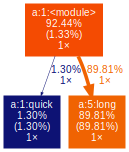

= Python
:toc: macro

My notes on python specific development.

toc::[]

== Useful Python Projects

Development tools:
* https://github.com/coveragepy/coveragepy[coverage]: python code coverage
* https://github.com/asottile/covdefaults[covdefaults]: nice defaults to coverage
* https://github.com/asottile/pyupgrade[pyupgrade]: upgrade python syntax
* https://github.com/psf/black[black]: opinionated python formatting
* https://github.com/asottile/astpretty[astpretty]: pretty print python ast
* https://github.com/pre-commit/pre-commit[pre-commit]: manage pre-commit hooks
* https://github.com/pre-commit/pre-commit-hooks[pre-commit-hooks]: basic hooks for universal needs
* https://github.com/jrfonseca/gprof2dot[gprof2dot]: converts profiling data into a dot graph
* https://github.com/PyCQA/isort[isort]: sort and style imports
* https://github.com/asottile/all-repos[all-repos]: make sweeping changes across repos
* https://github.com/pytest-dev/pytest[pytest]: ergonomic test framework
* https://github.com/PyCQA/flake8[flake8]: python style and quality checks

Libraries:
* https://github.com/asottile/tokenize-rt[tokenize-rt]: improves upon stdlib tokenize for roundtrips
* https://github.com/tox-dev/platformdirs[platformdirs]: platform-specific directories
* https://github.com/tox-dev/filelock[filelock]: file lock interface

== Project layout

Prefer to use the "src layout" for python projects.
The src layout avoids common development pitfalls from the
python interpreter adding the current working
directory in the import search path.

.Example "src layout" project tree
[source]
----
.
├── README.adoc
├── pyproject.toml
└── src/
    └── my_python_package/
        ├── __init__.py
        └── module.py
----

References

* https://packaging.python.org/en/latest/discussions/src-layout-vs-flat-layout/[Python Packaging: src layout vs flat layout]

== Profiling

A few useful ways to profile and visualize performance.

=== Import time profiling

The python command provides an option to show how long each import
takes.

.Example:
[source,console]
----
$ python3 -X importtime -c "import pprint"
import time: self [us] | cumulative | imported package
import time:       439 |        439 |   _io
import time:        80 |         80 |   marshal
import time:       596 |        596 |   posix
import time:      1286 |       2400 | _frozen_importlib_external
import time:       191 |        191 |   time
import time:       508 |        698 | zipimport
import time:       112 |        112 |     _codecs
import time:      1116 |       1227 |   codecs
import time:       826 |        826 |   encodings.aliases
...
----

The output includes import time of modules that are always
imported as a part of the interpreter startup. Interpretting
the output can be a little difficult given the odd semi-reverse
ordering. The
https://github.com/asottile/importtime-waterfall/[importtime-waterfall]
tool provides slightly more sane console output along with a
pathway for visualizing the import times.

.importtime-waterfall:
[source,console]
----
$ importtime-waterfall pprint
pprint (512)
  collections (1317)
    itertools (202)
    keyword (204)
    operator (462)
      _operator (115)
    reprlib (321)
    _collections (116)
  dataclasses (1046)
    re (919)
      enum (2768)
        functools (925)
          _functools (99)
        types (440)
      re._compiler (555)
        _sre (118)
        re._parser (607)
          re._constants (422)
        re._casefix (175)
      copyreg (278)
    copy (298)
      weakref (710)
        _weakrefset (342)
    inspect (3929)
      ast (2248)
        _ast (1712)
        contextlib (1028)
      dis (1441)
        opcode (486)
          _opcode (106)
          _opcode_metadata (317)
      importlib.machinery (110)
        importlib (266)
      tokenize (1337)
        token (273)
        _tokenize (63)
----

=== Deterministic profiling
:data-uri:

Use the `cProfile` module for deterministic profiling of
an application. The profile can be visualized with a combination
of `gprof2dot` and `dot`.

.script.py
[source,python]
----
def quick():
    for _ in range(100):
        pass

def long():
    for _ in range(10000):
        pass

quick()
long()
----

.Standard cProfile output
[source,console]
----
$ python3 -m cProfile script.py
         5 function calls in 0.150 seconds

   Ordered by: cumulative time

   ncalls  tottime  percall  cumtime  percall filename:lineno(function)
        1    0.000    0.000    0.150    0.150 {built-in method builtins.exec}
        1    0.000    0.000    0.150    0.150 a.py:1(<module>)
        1    0.134    0.134    0.134    0.134 a.py:5(long)
        1    0.016    0.016    0.016    0.016 a.py:1(quick)
        1    0.000    0.000    0.000    0.000 {method 'disable' of '_lsprof.Profiler' objects}

----

.Visualizing cProfile output
[source,console]
----
$ python3 -m cProfile --outfile profile.pstats script.py
$ gprof2dot --root 'script:1:<module>' --format pstats profile.pstats | dot -Tsvg -o profile.svg
$ firefox profile.svg &
----

== One import per line

Separate imports to one import per line.

.Example:
[source,bash]
----
from os import path
from os import system
----

This is a step further from PEP 8 style that helps to avoid
merge conflicts. Use the pre-commit hook `reorder-python-imports`
to automatically separate imports.

References:

* https://github.com/asottile/reorder-python-imports[reorder-python-imports]
* https://peps.python.org/pep-0008/#imports[PEP 8: Imports]

== os.system

Prefer `subprocess.run(..., shell=False)` or
`subprocess.call(..., shell=False)` instead of `os.system()`.

The `os.system()` function executes a command in a subshell. First a shell
process is created then the shell spawns a process for the command resulting in
two child processes. There are performance, security, and compatibility reasons
to avoid executing a command in a subshell.

* Spawning a shell process adds overhead. For quick commands repeated often the
overhead could be significant.
* The `os.system()` function ignores SIGINT and SIGQUIT while the command is
running.
* Using a subshell assumes the shell syntax and language which may not be
compatible with a different OS or shell.
* Using a subshell process is a risk for shell injection, especially if the
command involves user input.
+
.Example shell injection:
[source,python]
----
>>> import os
>>> # Possible input from user
>>> file_name = "foo.txt; echo hello world"
>>> retcode = os.system(f"touch {file_name}")
hello world
----

References:

* https://www.youtube.com/watch?v=oQxTSDh-ECk[anthony explains... don't use os.system!]
* https://docs.python.org/3/library/os.html#os.system[os.system()]
* https://docs.python.org/3/library/subprocess.html#replacing-os-system[Replacing os.system() with subprocess]
